# 期中作業

## JPEG解碼器
此為引用 [這裡](https://github.com/MROS/jpeg_tutorial) 的JPEG解碼器專案，原作者以JPEG轉換為PPM為例。我對於JPEG解碼的過程已大部分理解，而將其轉換為PPM檔的過程不太理解。預計期末製作將其轉換為PNG檔的程式。

## JPEG 編/解碼流程
首先來說明JPEG編解碼的主要流程 : 

JPEG 會透過 DCT 變換，將原色彩空間映射到新空間，再使用霍夫曼編碼嘗試進行壓縮。其中會先將 JPEG 的顏色從 RGB 空間轉換成 YCbCr 空間後降採樣，而在 DCT 便變換之後量化新空間裡的數據。以上就是 JPEG 的解碼流程，反之則是編碼。圖形化說明如下 : 

其中比較特別需要注意的是 : 

JPEG 是以分塊進行壓縮的，而一個區塊就是 1 MCU ( MinimumCodedUnit )，意思是最小編碼單元，基本上是以 " 由上到下、左到右 " 的順序壓縮。其中 MCU 的長寬會根據垂直、水平採樣率變化。詳情請看下圖 : 

## 以下為實際試測結果 : 
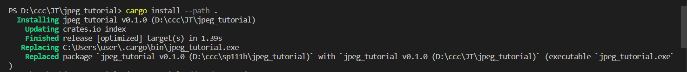
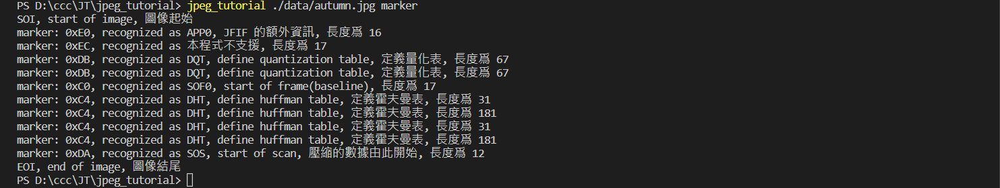
## 詳細資料請看下圖 : 
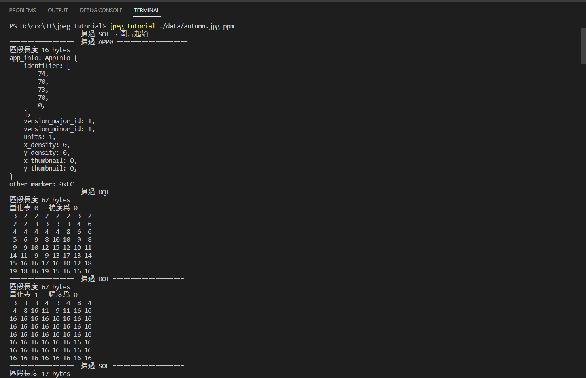
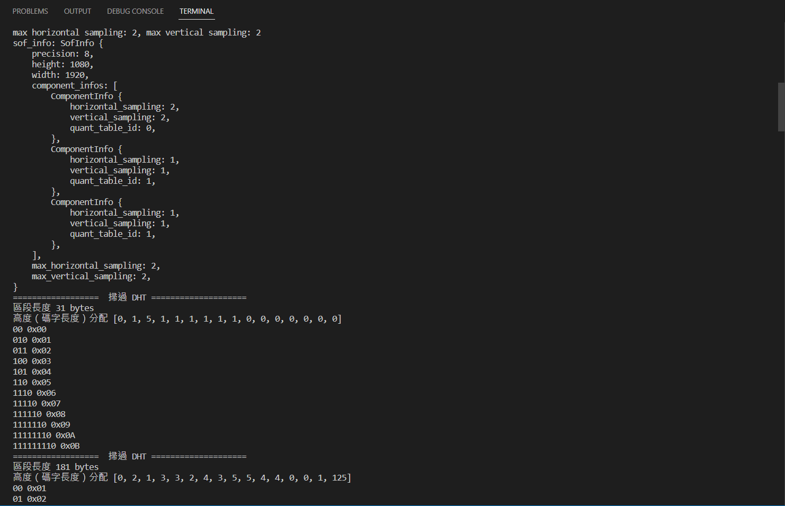
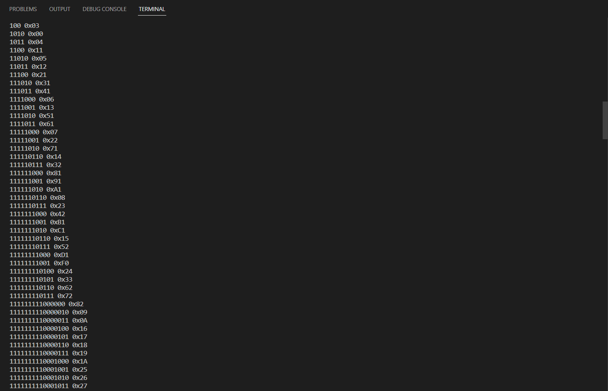
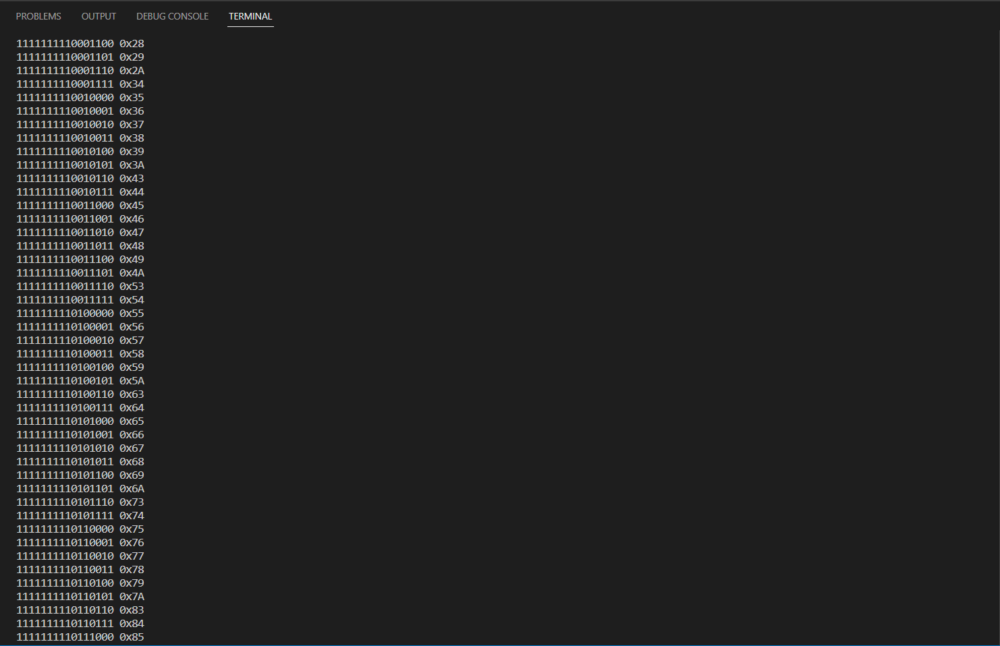
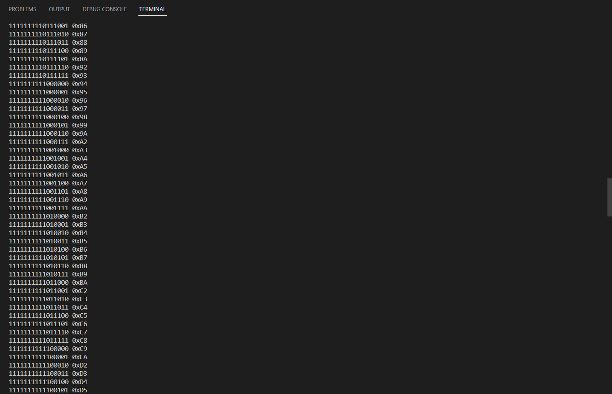
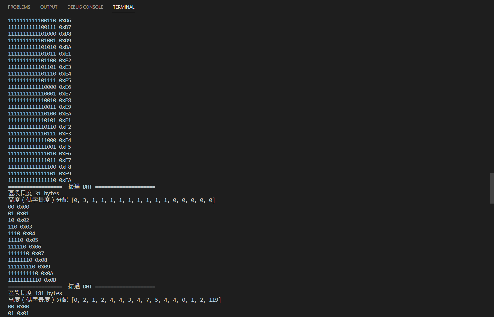
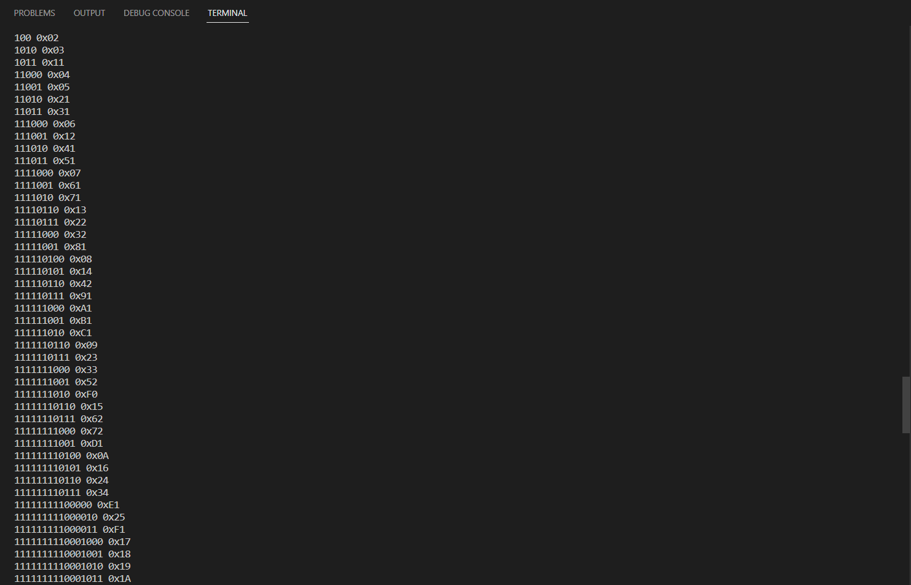
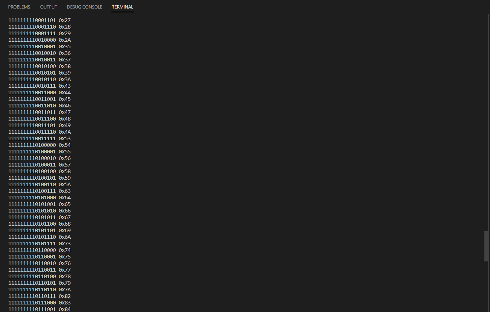
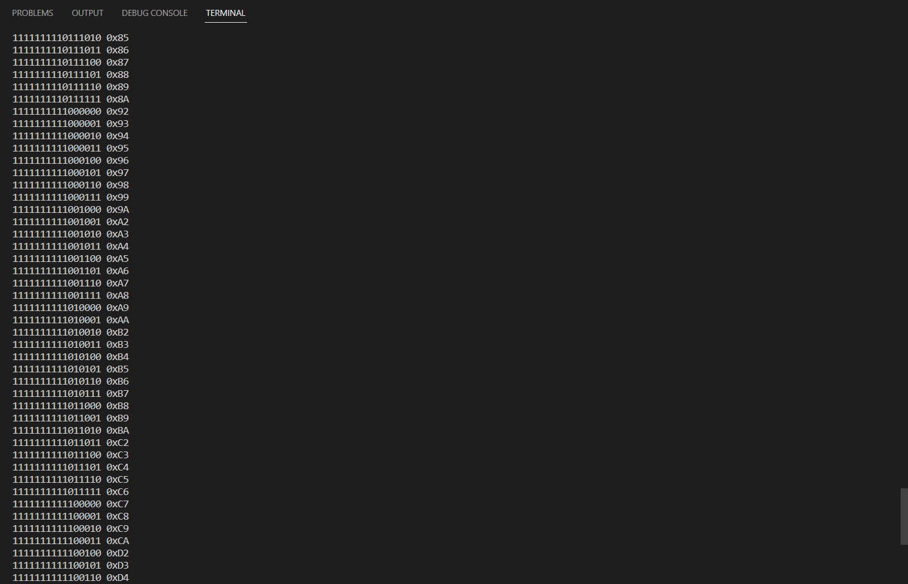
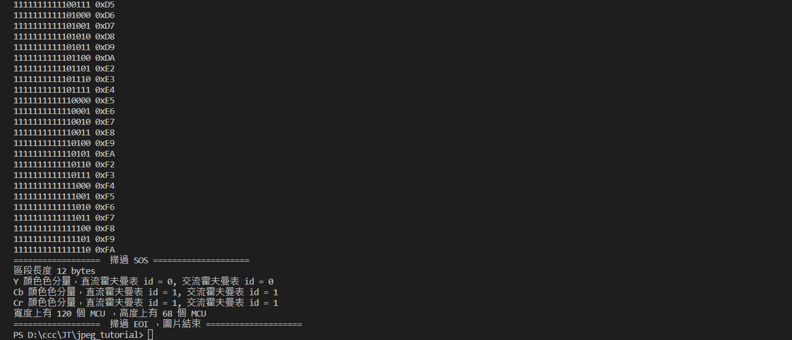
